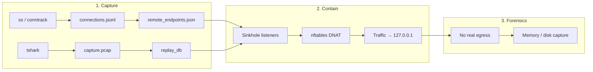
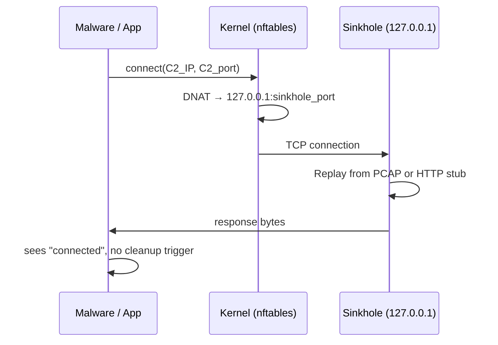
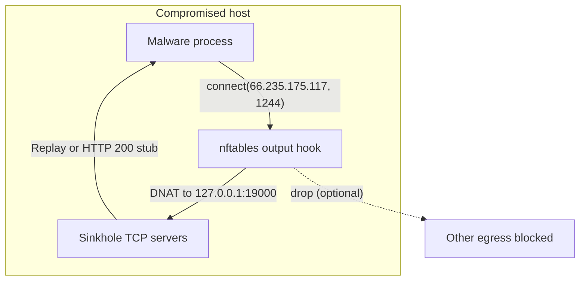
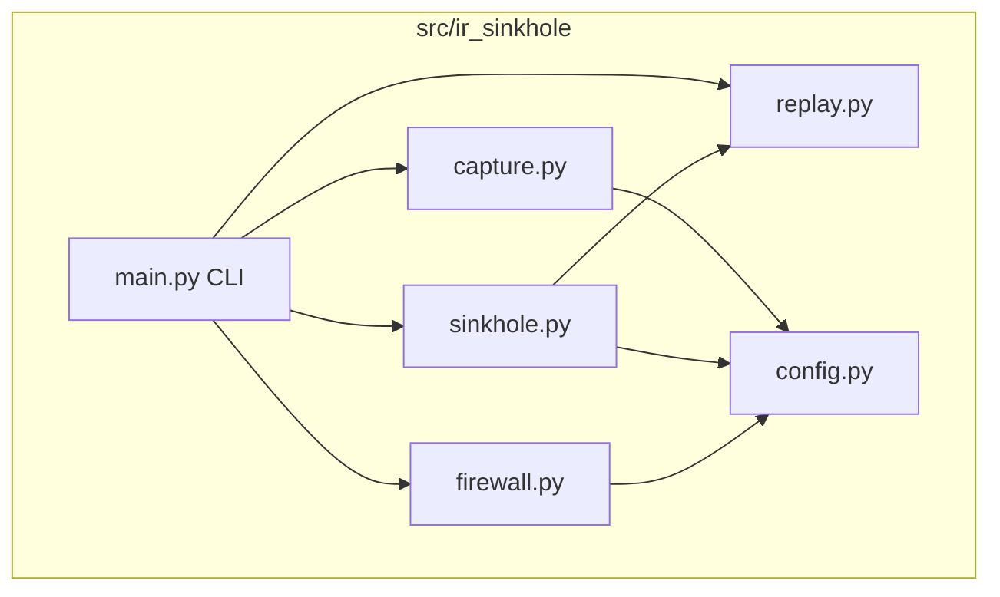

# IR Sinkhole

[](LICENSE)
[](https://www.python.org/downloads/)
[](https://github.com/Leviticus-Triage/ir-sinkhole/actions/workflows/tests.yml)

**Host-based incident response sinkhole** that redirects outbound C2 traffic locally to preserve evidence and avoid malware disconnect triggers (dead-man switch, anti-forensics) during containment.

**Target audience:** CSIRT, CERT, SOC, DFIR teams, security researchers. Aligns with NIST SP 800-61 Rev. 2 and SANS IR containment practices.

---

## Table of contents

- [How it works](#how-it-works)
- [Architecture overview](#architecture-overview)
- [Technical components](#technical-components)
- [Requirements](#requirements)
- [Install](#install)
- [How-to: Usage](#how-to-usage)
- [How-to: ASCII menu (one-liner)](#how-to-ascii-menu-one-liner)
- [Output layout](#output-layout)
- [Scope and limitations](#scope-and-limitations)
- [Security considerations](#security-considerations)
- [Terminology](#terminology)
- [Documentation](#documentation)
- [Contributing](#contributing)
- [License](#license)

---

## How it works

Containment is done in three phases:



1. **Capture (pre-isolation):** Poll active TCP connections (`ss` / `conntrack`) and optionally run **tshark** to record traffic. Output: unique remote endpoints and, from PCAP, server→client payloads for replay.
2. **Contain:** Start local TCP listeners (sinkhole) per endpoint; install **nftables** rules that DNAT outbound traffic to those endpoints to `127.0.0.1:<sinkhole_port>`. Optionally drop all other egress. Malware retries hit the sinkhole (replay or HTTP stub); no real traffic leaves the host.
3. **Forensics:** Run memory/disk capture and live analysis while the malware does not see a hard disconnect.

---

## Architecture overview



Data flow during **containment**:



See [docs/ARCHITECTURE.md](docs/ARCHITECTURE.md) for threat model, design rationale, and data flow details.

---

## Technical components

| Component | Role | Implementation |
|-----------|------|----------------|
| **Capture** | Record active TCP connections and optional PCAP | `capture.py`: `ss` / `conntrack` parsing, `TsharkCapture` subprocess |
| **Replay DB** | Extract server→client payloads per (IP, port) from PCAP | `replay.py`: scapy (with dpkt fallback), `build_replay_db()`, save/load JSON |
| **Sinkhole** | TCP listeners that replay or send stub | `sinkhole.py`: asyncio servers per endpoint, `_handle_client()`, HTTP 200 stub |
| **Firewall** | DNAT + optional egress drop | `firewall.py`: nftables table `ir_sinkhole`, output hook, one rule per endpoint |
| **CLI** | Entry point and subcommands | `main.py`: `status`, `capture`, `contain`, `stop` |



---

## Requirements

- **Linux** with **nftables** (kernel 3.13+)
- **Python 3.10+**
- **Root** for `capture` and `contain`
- **tshark** (optional, recommended for replay)
- **scapy** (optional, for PCAP replay DB)

---

## Install

### From Git

```bash
git clone https://github.com/Leviticus-Triage/ir-sinkhole.git
cd ir-sinkhole
pip install -e .
# or: pip install -e ".[dev]"
```

### One-liner (install + run ASCII menu)

```bash
curl -sSL https://raw.githubusercontent.com/Leviticus-Triage/ir-sinkhole/main/scripts/ir-sinkhole-menu.sh | sudo bash
```

This installs dependencies (apt), clones to `/opt/ir-sinkhole`, sets up the venv, and starts the interactive menu.

### Install script only (no menu)

```bash
curl -sSL https://raw.githubusercontent.com/Leviticus-Triage/ir-sinkhole/main/install.sh | sudo bash
```

---

## How-to: Usage

### 1. Status (no root)

```bash
ir-sinkhole status
```

Shows current TCP connections, unique remote endpoints, and whether containment is active.

### 2. Capture (root)

Capture for 15 minutes (default), with tshark:

```bash
sudo ir-sinkhole capture -d 15m -o /var/lib/ir-sinkhole
```

Options: `-d 15m|1h|2h` or seconds, `-o DIR`, `-i any`, `--no-tshark`, `--tshark-filter tcp`.

### 3. Contain (root)

After capture, start sinkhole and redirect traffic:

```bash
sudo ir-sinkhole contain -o /var/lib/ir-sinkhole
```

- `--port-start 19000` — first local port for sinkhole  
- `--no-drop-egress` — only redirect, do not drop other egress  
- `--record-pcap PATH` — record loopback traffic during containment  

**Ctrl+C** stops containment and removes nftables rules.

### 4. Stop (root)

Remove firewall and PID file:

```bash
sudo ir-sinkhole stop
```

---

## How-to: ASCII menu (one-liner)

Run the menu (install + dependencies + interactive prompts):

```bash
curl -sSL https://raw.githubusercontent.com/Leviticus-Triage/ir-sinkhole/main/scripts/ir-sinkhole-menu.sh | sudo bash
```

Menu options: **[1] Status**, **[2] Capture**, **[3] Contain**, **[4] Stop**, **[5] Quit**. Each action prompts for duration, output dir, interface, etc., then runs the corresponding `ir-sinkhole` command.

---

## Output layout

```
/var/lib/ir-sinkhole/
├── connections.jsonl      # Periodic connection snapshots
├── remote_endpoints.json  # Unique (ip, port) for contain
├── capture.pcap           # From tshark (if enabled)
├── replay_db.json         # Server→client payloads (if scapy + pcap)
└── nft_containment.nft    # Generated nftables script (inspection/restore)
```

---

## Scope and limitations

- **TCP only.** No UDP/ICMP redirect or replay.
- **Outbound only.** Inbound traffic is not modified.
- **IPv4 only.** nftables rules use `ip` family; IPv6 can be added later.
- **Best-effort replay.** TCP payloads are ordered by sequence; no full reassembly of overlaps/retransmits.
- **No TLS inspection.** Replay is opaque bytes; no decryption.
- **Single host.** No coordination across multiple machines.

---

## Security considerations

- **Root required** for capture and containment. Run only on hosts under IR control.
- **No telemetry.** All state stays in the configured output directory.
- **Vulnerability reporting:** See [SECURITY.md](SECURITY.md).

---

## Terminology

| Behavior | Term |
|----------|------|
| Cleanup on disconnect | Dead-man switch, persistence degradation |
| Log/evidence removal | Anti-forensics, log wiping |
| Process manipulation | Process hollowing, process injection |
| Hiding on trigger | Stealth / evasive mode |
| Config change on trigger | Polymorphic / config rotation |

---

## Documentation

| Document | Description |
|----------|--------------|
| [docs/ARCHITECTURE.md](docs/ARCHITECTURE.md) | Design, threat model, data flow, Mermaid |
| [docs/HOWTO.md](docs/HOWTO.md) | Step-by-step workflows and test scenario |
| [docs/TECHNICAL.md](docs/TECHNICAL.md) | Code structure, modules, CLI reference |
| [docs/systemd-example.md](docs/systemd-example.md) | Optional systemd service for containment |
| [SECURITY.md](SECURITY.md) | Vulnerability reporting |
| [CONTRIBUTING.md](CONTRIBUTING.md) | How to contribute |
| [CHANGELOG.md](CHANGELOG.md) | Version history |

---

## Contributing

See [CONTRIBUTING.md](CONTRIBUTING.md) and [SECURITY.md](SECURITY.md).

---

## License

MIT. See [LICENSE](LICENSE).
