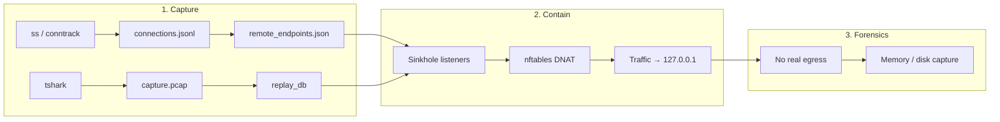
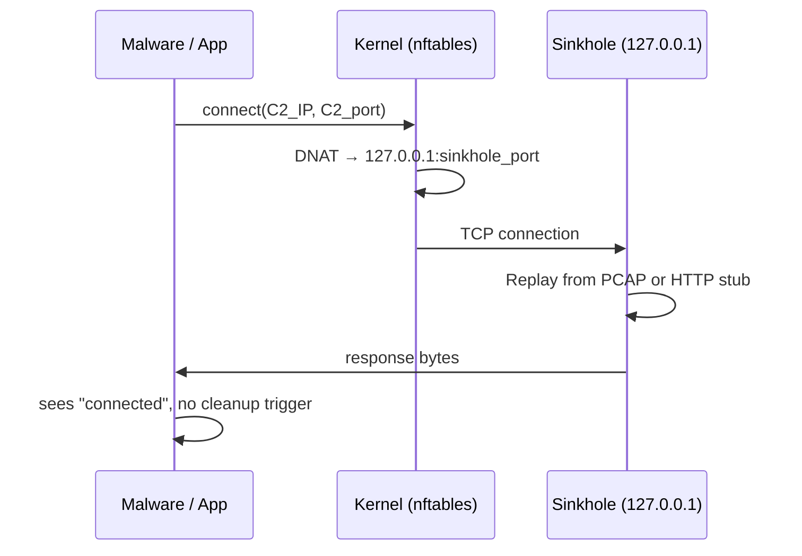
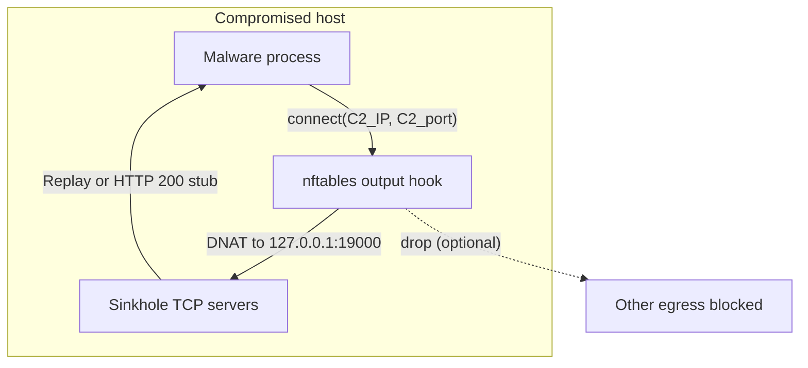
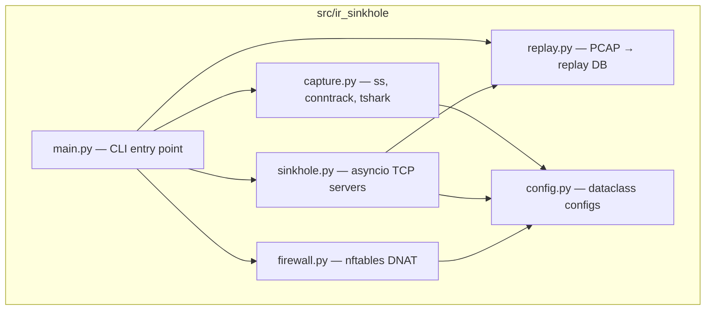

# IR Sinkhole

[](LICENSE)
[](https://www.python.org/downloads/)
[](#requirements)
[](https://github.com/Leviticus-Triage/ir-sinkhole/actions/workflows/tests.yml)

**Host-based incident response sinkhole** that silently redirects outbound C2 traffic to local listeners — preserving forensic evidence while preventing malware disconnect triggers during containment.

> **Target audience:** CSIRT, CERT, SOC L2/L3, DFIR teams, and security researchers.
> Aligns with **NIST SP 800-61 Rev. 2** (containment, eradication, recovery) and **SANS IR** containment practices.

---

## Table of contents

- [Problem statement](#problem-statement)
- [Quick start](#quick-start)
- [How it works](#how-it-works)
- [Architecture overview](#architecture-overview)
- [MITRE ATT\&CK mapping](#mitre-attck-mapping)
- [Use cases](#use-cases)
- [Technical components](#technical-components)
- [Repository structure](#repository-structure)
- [Requirements](#requirements)
- [Install](#install)
- [CLI reference](#cli-reference)
- [Interactive menu (one-liner)](#interactive-menu-one-liner)
- [Output layout](#output-layout)
- [Scope and limitations](#scope-and-limitations)
- [Security considerations](#security-considerations)
- [Terminology](#terminology)
- [Documentation index](#documentation-index)
- [Contributing](#contributing)
- [License](#license)

---

## Problem statement

During incident response, the first instinct is to **disconnect** a compromised host from the network. However, many malware families — especially RATs, infostealers, and APT implants — actively monitor their network connectivity and trigger **evasive or destructive behavior** when they detect a loss of connection:

| Trigger behavior | Risk to the investigation |
|------------------|---------------------------|
| Dead-man switch / persistence degradation | Cleanup routines destroy artifacts, remove persistence, or exit silently |
| Anti-forensics (log wiping) | Event logs, shell history, and file system timestamps are overwritten or deleted |
| Process hollowing / injection | Malicious code migrates into legitimate processes, complicating memory forensics |
| Config rotation / polymorphism | IOCs change (domains, hashes, encryption keys), invalidating existing signatures |
| Stealth / evasive mode | Malware goes dormant or hides deeper, making detection harder |

**IR Sinkhole solves this** by intercepting outbound traffic at the kernel level (nftables DNAT) and routing it to local TCP servers that mimic the original C2 responses — either replaying captured PCAP data or sending minimal stubs. The malware sees an active connection and does not trigger cleanup routines, giving the responder time for memory dumps, disk imaging, and live forensics.

---

## Quick start

Three commands on the compromised host (as root):

```bash
# 1. Capture active connections + traffic (adjust duration to your needs)
sudo ir-sinkhole capture -d 15m -o /var/lib/ir-sinkhole

# 2. Start sinkhole — redirect all captured C2 traffic locally
sudo ir-sinkhole contain -o /var/lib/ir-sinkhole

# 3. Perform forensics while containment is active, then stop
#    (Ctrl+C in the contain terminal, or from another shell:)
sudo ir-sinkhole stop
```

Or use the **interactive menu** (zero-install one-liner):

```bash
curl -sSL https://raw.githubusercontent.com/Leviticus-Triage/ir-sinkhole/main/scripts/run.sh | bash
```

---

## How it works

Containment follows three distinct phases:



1. **Capture (pre-isolation):** Poll active TCP connections via `ss` / `conntrack` and optionally run `tshark` to record a PCAP. Output: unique remote endpoints `(IP, port)` and server→client payloads for replay.
2. **Contain:** For each endpoint, start a local TCP server on `127.0.0.1`; install `nftables` DNAT rules redirecting outbound traffic to the sinkhole. Optionally drop all other egress. The sinkhole replays captured payloads or sends an HTTP 200 stub — no real traffic leaves the host.
3. **Forensics:** Run memory/disk capture and live analysis while the malware does not detect a disconnect.

---

## Architecture overview



Data flow during **containment**:



See [docs/ARCHITECTURE.md](docs/ARCHITECTURE.md) for threat model, design rationale, and full data flow.

---

## MITRE ATT&CK mapping

IR Sinkhole addresses evasive behaviors categorized under the following ATT&CK techniques. The containment prevents these from firing by maintaining the illusion of network connectivity.

| Technique ID | Technique name | What the malware does | How IR Sinkhole prevents it |
|-------------|----------------|----------------------|----------------------------|
| [T1070](https://attack.mitre.org/techniques/T1070/) | Indicator Removal | Deletes logs, clears event records, overwrites timestamps | Sinkhole keeps connection alive → cleanup routine not triggered |
| [T1070.004](https://attack.mitre.org/techniques/T1070/004/) | File Deletion | Removes malware binaries, configs, or exfil staging files | No disconnect signal → files remain on disk for acquisition |
| [T1055](https://attack.mitre.org/techniques/T1055/) | Process Injection | Migrates into legitimate process on connectivity loss | Connection appears stable → no migration trigger |
| [T1027](https://attack.mitre.org/techniques/T1027/) | Obfuscated Files or Information | Rotates encryption, changes config, morphs payload | No trigger event → IOCs remain consistent during analysis |
| [T1497](https://attack.mitre.org/techniques/T1497/) | Virtualization/Sandbox Evasion | Detects analysis environment via network fingerprint | Replayed PCAP data mimics real C2 responses |
| [T1571](https://attack.mitre.org/techniques/T1571/) | Non-Standard Port | C2 over custom TCP ports | Sinkhole binds per-endpoint, any port combination |
| [T1573](https://attack.mitre.org/techniques/T1573/) | Encrypted Channel | TLS/custom encryption to C2 | Opaque byte replay — sinkhole doesn't need to decrypt |

---

## Use cases

### 1. Active RAT / C2 implant (e.g. Operation Dream Job-style)

A compromised workstation has an active HTTP-based RAT beaconing to a C2 server on a non-standard port. Disconnecting the host would trigger the implant's dead-man switch (log wiping + process hollowing).

**With IR Sinkhole:** Capture the C2 endpoint and beacon traffic for 15 minutes, then activate containment. The RAT continues to "beacon" to localhost and receives replayed responses. Meanwhile, the responder performs a memory dump with LiME and images the disk.

### 2. Infostealer with exfiltration queue

An infostealer stages data in a local directory and exfiltrates over TCP when connected. On disconnect, it encrypts and deletes the staging directory.

**With IR Sinkhole:** Containment prevents the exfil connection from failing → staging data remains unencrypted on disk → responder can acquire the staged data before it's destroyed.

### 3. Multi-stage loader with C2 heartbeat

A loader checks in with its C2 every 60 seconds. If three heartbeats fail, it uninstalls all child payloads and removes persistence.

**With IR Sinkhole:** The sinkhole responds to heartbeat connections with replayed data, keeping the "three-strike" counter at zero. Child payloads and persistence mechanisms remain in place for forensic analysis.

### 4. Post-compromise triage on a server

A web server is suspected of compromise. The SOC needs to triage without alerting the attacker (who monitors a reverse shell).

**With IR Sinkhole:** Capture the reverse shell connection, then contain. The attacker's shell appears to stay connected (receives replayed data), while the SOC runs forensics and prepares for coordinated remediation.

---

## Technical components

| Component | Role | Implementation |
|-----------|------|----------------|
| **Capture** | Record active TCP connections and optional PCAP | `capture.py` — `ss` / `conntrack` parsing, `TsharkCapture` subprocess |
| **Replay DB** | Extract server→client payloads per (IP, port) from PCAP | `replay.py` — scapy (dpkt fallback), `build_replay_db()`, JSON serialization |
| **Sinkhole** | TCP listeners that replay or send stub responses | `sinkhole.py` — asyncio servers per endpoint, HTTP 200 stub fallback |
| **Firewall** | DNAT + optional egress drop | `firewall.py` — nftables table `ir_sinkhole`, output hook, per-endpoint rules |
| **CLI** | Entry point and subcommands | `main.py` — `status`, `capture`, `contain`, `stop` |
| **Menu** | Interactive one-liner with guided prompts | `scripts/ir-sinkhole-menu.sh` — color-coded, verbose, download-then-run |



---

## Repository structure

```
ir-sinkhole/
├── src/ir_sinkhole/            # Python package
│   ├── __init__.py             # Version (__version__ = "1.0.0")
│   ├── config.py               # CaptureConfig, SinkholeConfig, FirewallConfig
│   ├── capture.py              # Connection polling (ss/conntrack), tshark wrapper
│   ├── replay.py               # PCAP parsing (scapy/dpkt), replay DB build/save/load
│   ├── sinkhole.py             # Asyncio TCP servers with replay or stub handler
│   ├── firewall.py             # nftables rule management (add/remove/export)
│   └── main.py                 # CLI: status, capture, contain, stop
├── scripts/
│   ├── run.sh                  # Bootstrap for curl one-liner (download-then-run)
│   └── ir-sinkhole-menu.sh     # Interactive ASCII menu with guided prompts
├── docs/
│   ├── ARCHITECTURE.md         # Design, threat model, data flow diagrams
│   ├── HOWTO.md                # Step-by-step IR workflows and test scenario
│   ├── TECHNICAL.md            # Code structure, module API, CLI reference
│   └── systemd-example.md      # Optional systemd service unit
├── tests/
│   ├── test_capture.py         # ss output parsing, endpoint deduplication
│   └── test_replay.py          # Replay DB serialization, edge cases
├── .github/workflows/
│   └── tests.yml               # CI: Python 3.10, 3.11, 3.12
├── pyproject.toml              # Build config, dependencies, entry point
├── install.sh                  # Non-interactive install script
├── README.md                   # This file
├── LICENSE                     # MIT
├── SECURITY.md                 # Vulnerability reporting
├── CONTRIBUTING.md             # Contribution guidelines
├── CHANGELOG.md                # Version history (Keep a Changelog)
└── CITATION.cff                # Academic citation metadata
```

---

## Requirements

- **Linux** with **nftables** (kernel 3.13+, any modern distro)
- **Python 3.10+**
- **Root** for `capture` and `contain` (nftables and raw sockets)
- **tshark** — optional but recommended (enables PCAP-based replay)
- **scapy** — optional (enables PCAP parsing for replay DB; dpkt as fallback)

---

## Install

### Option A: From Git (recommended for development)

```bash
git clone https://github.com/Leviticus-Triage/ir-sinkhole.git
cd ir-sinkhole
python3 -m venv .venv && source .venv/bin/activate
pip install -e .
```

### Option B: One-liner with interactive menu

```bash
curl -sSL https://raw.githubusercontent.com/Leviticus-Triage/ir-sinkhole/main/scripts/run.sh | bash
```

This downloads the menu script, prompts for sudo, installs system dependencies, clones to `/opt/ir-sinkhole`, creates a virtualenv, and launches the interactive menu with color-coded output and guided prompts.

### Option C: Non-interactive install (scripted/headless)

```bash
curl -sSL https://raw.githubusercontent.com/Leviticus-Triage/ir-sinkhole/main/install.sh | sudo bash
```

After install, `ir-sinkhole` is available as a CLI command.

---

## CLI reference

| Command | Description | Key options |
|---------|-------------|-------------|
| `ir-sinkhole status` | Show active TCP connections and containment state | — |
| `ir-sinkhole capture` | Record connections + optional PCAP | `-d 15m\|1h\|2h`, `-o DIR`, `-i IFACE`, `--no-tshark`, `--tshark-filter BPF` |
| `ir-sinkhole contain` | Start sinkhole, apply nftables DNAT | `-o DIR`, `--port-start 19000`, `--no-drop-egress`, `--record-pcap PATH` |
| `ir-sinkhole stop` | Remove firewall rules and PID file | — |

Global: `-v` / `--verbose` for DEBUG-level logging.

### Typical workflow

```bash
# 1. Check current state
ir-sinkhole status

# 2. Capture for 15 minutes with tshark
sudo ir-sinkhole capture -d 15m -o /var/lib/ir-sinkhole

# 3. Verify captured endpoints
cat /var/lib/ir-sinkhole/remote_endpoints.json

# 4. Start containment (Ctrl+C to stop)
sudo ir-sinkhole contain -o /var/lib/ir-sinkhole

# 5. Explicit stop (if needed)
sudo ir-sinkhole stop
```

---

## Interactive menu (one-liner)

The interactive menu provides a **guided experience** with color-coded output, per-action configuration prompts, and verbose feedback at every step.

```bash
curl -sSL https://raw.githubusercontent.com/Leviticus-Triage/ir-sinkhole/main/scripts/run.sh | bash
```

The bootstrap script (`run.sh`) downloads the menu to a temp file and executes it with terminal stdin — this ensures interactive prompts work correctly even when piped through `curl`.

**Menu options:**

| Option | Action | Interactive prompts |
|--------|--------|---------------------|
| **[1] Status** | Show connections + containment state | — |
| **[2] Capture** | Start recording | Duration, output dir, interface, tshark (Y/n) |
| **[3] Contain** | Start sinkhole + firewall | Output dir, port start, drop egress (Y/n), record PCAP |
| **[4] Stop** | Remove firewall | — |
| **[5] Quit** | Exit menu | — |

Each action shows step-by-step feedback and returns to the menu via `Press Enter to return to menu...`.

---

## Output layout

```
/var/lib/ir-sinkhole/
├── connections.jsonl      # Periodic connection snapshots (one JSON per poll)
├── remote_endpoints.json  # Unique (ip, port) pairs for containment
├── capture.pcap           # Raw traffic capture (tshark, if enabled)
├── replay_db.json         # Server→client payloads per endpoint (base64)
└── nft_containment.nft    # Generated nftables script (for inspection/restore)
```

---

## Scope and limitations

| Area | Status |
|------|--------|
| **TCP** | Fully supported (capture, redirect, replay) |
| **UDP / ICMP** | Not supported (no redirect or replay) |
| **Direction** | Outbound only; inbound traffic is not modified |
| **IP version** | IPv4 only; IPv6 possible via separate `ip6` table |
| **TLS** | Opaque byte replay; no decryption or MitM |
| **Replay fidelity** | Best-effort (sequence-ordered payloads; no overlap/retransmit reassembly) |
| **Scope** | Single host; no cross-machine coordination |

---

## Security considerations

- **Root required** for capture (raw sockets) and containment (nftables). Run only on hosts under active IR control.
- **No telemetry.** All state is local to the configured output directory.
- **Sensitive output.** PCAPs and connection logs may contain credentials, tokens, or exfiltrated data — handle according to organizational evidence procedures.
- **Vulnerability reporting:** See [SECURITY.md](SECURITY.md).

---

## Terminology

| Behavior | Correct term(s) |
|----------|-----------------|
| Cleanup on disconnect | Dead-man switch, persistence degradation |
| Log/evidence removal | Anti-forensics, log wiping, timestomping |
| Process manipulation | Process hollowing (T1055.012), process injection (T1055) |
| Hiding on trigger | Stealth / evasive mode, defense evasion |
| Config change on trigger | Polymorphic behavior, config rotation, C2 channel switching |
| Detection of analysis | Sandbox evasion (T1497), environment keying |

---

## Documentation index

| Document | Description |
|----------|-------------|
| [docs/ARCHITECTURE.md](docs/ARCHITECTURE.md) | Design rationale, threat model, data flow (Mermaid) |
| [docs/HOWTO.md](docs/HOWTO.md) | Step-by-step IR workflows, quick test, troubleshooting |
| [docs/TECHNICAL.md](docs/TECHNICAL.md) | Code structure, module API, CLI reference, data formats |
| [docs/systemd-example.md](docs/systemd-example.md) | Optional systemd service for long-running containment |
| [SECURITY.md](SECURITY.md) | Vulnerability disclosure policy |
| [CONTRIBUTING.md](CONTRIBUTING.md) | Contribution guidelines |
| [CHANGELOG.md](CHANGELOG.md) | Version history (Keep a Changelog / SemVer) |
| [CITATION.cff](CITATION.cff) | Academic citation metadata |

---

## Contributing

See [CONTRIBUTING.md](CONTRIBUTING.md) and [SECURITY.md](SECURITY.md).

---

## License

MIT. See [LICENSE](LICENSE).
