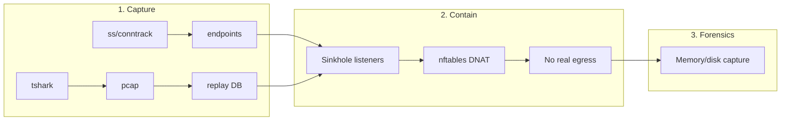
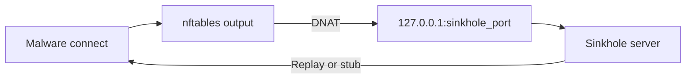
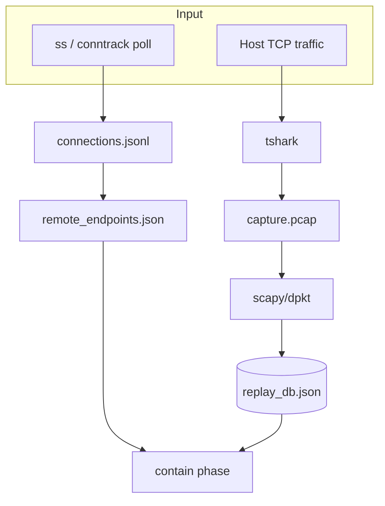
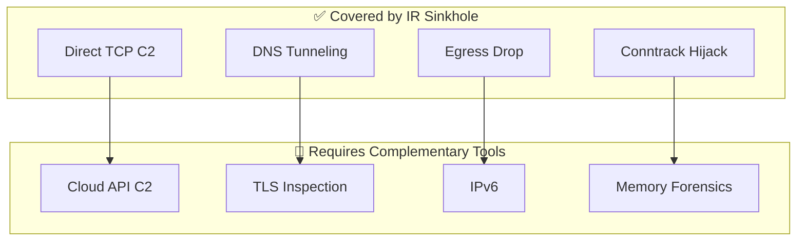
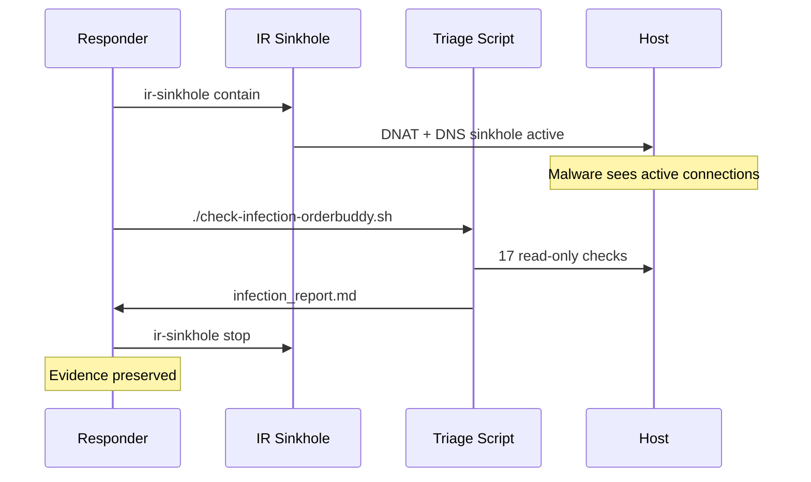

# IR Sinkhole - Architecture and Design

This document describes the design rationale, threat model, data flow, and technical decisions for IR Sinkhole. It is intended for CSIRT/CERT reviewers, security architects, and contributors.

---

## 1. Problem statement

During incident response, analysts often need to **contain** a compromised host (stop further damage and exfiltration) while **preserving evidence** (memory, disk, logs). If the host is simply disconnected from the network, many malware families detect the loss of connectivity and trigger:

- **Dead-man switch / persistence degradation:** cleanup routines, process exit, or removal of artifacts
- **Anti-forensics:** log wiping, file encryption or deletion, overwriting of sensitive data
- **Evasive behavior:** process hollowing, injection, or config rotation to hinder analysis

So the goal is: **containment without signaling “disconnect”** to the malware. The host must appear to remain connected to the same remote endpoints (e.g. C2), while in reality no traffic leaves the host.

---

## 2. Threat model and assumptions

- **Adversary:** Malware (RAT, infostealer, etc.) that maintains outbound TCP connections to C2 or other remote services and may react to connection failure or timeout.
- **Defender:** Incident responder with root on the affected host, who can run capture and containment tools and modify local firewall (nftables).
- **Trust:** The tool itself is run in a controlled IR context; we do not model supply-chain compromise of the tool. Output directories and PCAPs are treated as sensitive and should be handled according to organizational IR procedures.
- **Scope:** Single host. No assumption of network-level sinkholing (e.g. at perimeter); everything is host-local.

---

## 3. High-level design

1. **Capture phase (pre-isolation)**  
   - Poll active TCP connections (`ss`, or `conntrack` as fallback) at a configurable interval.  
   - Optionally run `tshark` to record a PCAP of the same period.  
   - Persist: list of unique remote endpoints `(IP, port)` and, from PCAP, server→client TCP payloads per endpoint for replay.

2. **Containment phase**  
   - For each captured endpoint, start a **local TCP server** on `127.0.0.1` on a dedicated port (e.g. 19000, 19001, …).  
   - Install **nftables** rules in the `output` hook: for outbound packets whose destination is one of the captured endpoints, **DNAT** to the corresponding local sinkhole port. Optionally **drop** all other egress.  
   - When the malware (or any process) tries to connect to the original remote IP:port, the kernel redirects the connection to the local server. The sinkhole either **replays** server→client payloads from the PCAP or sends a minimal **HTTP 200** stub and keeps the connection open.  
   - Result: the application sees a successful connection and receives data (replay or stub); no packet leaves the host to the real C2.

3. **Forensics phase**  
   - Analyst can run memory/disk capture and live analysis while containment is active. Optionally, `--record-pcap` runs tshark on loopback to record the sinkhole traffic for anomaly analysis.

---

## 4. Data flow

### 4.1 Containment: packet path

### 4.2 Capture phase: data pipeline

---

## 5. Technical choices

- **nftables (not iptables):** Modern, scriptable, and easier to manage a dynamic set of DNAT rules. One table per run; cleanup is a single table delete.
- **Per-endpoint local port:** Each (remote_ip, remote_port) is mapped to a distinct local port so the sinkhole can look up replay data by the port on which the connection arrived.
- **Replay vs. stub:** If we have PCAP-derived payloads for that endpoint, we replay them in order to mimic C2 behavior. Otherwise we send a minimal HTTP 200 and keep the socket open to avoid RST/timeout.
- **TCP only (C2 data plane):** UDP or other protocols would require different handling (e.g. stateless reply or stateful proxy). Current scope is TCP-only for the sinkhole data plane. DNS (UDP 53) is separately handled by the DNS sinkhole module.
- **DNS Sinkhole:** Intercepts all outbound DNS queries via nftables redirect to a local UDP listener. Responds with `127.0.0.1` (A) / `::1` (AAAA) for all queries. Prevents DNS-based C2 tunneling (T1071.004) and blocks domain resolution for cloud API exfiltration.
- **Conntrack flush:** On containment start, existing conntrack entries for captured endpoints are purged. This forces the kernel to route subsequent packets for those flows through the DNAT rules rather than the existing NAT mapping. Without this, established connections bypass containment.
- **Management IP whitelist (`--allow-ip`):** Specified IPs are exempted from all containment rules (DNAT and egress drop). This prevents responder lockout during remote IR.
- **IPv4 only (current):** Rules are in the `ip` family. IPv6 can be added with a separate `ip6` table and the same logic.

---

## 6. Containment coverage matrix

### What IR Sinkhole handles

| Threat vector | MITRE ATT&CK | Mitigation | Module |
|--------------|--------------|------------|--------|
| Direct TCP C2 | T1571, T1573 | DNAT to local sinkhole with replay/stub | `sinkhole.py` + `firewall.py` |
| DNS C2 tunneling | T1071.004 | All UDP 53 → local DNS sinkhole | `dns_sinkhole.py` |
| Established connection hijacking | - | Conntrack flush on contain start | `firewall.py:flush_conntrack()` |
| Non-C2 egress (data exfil) | T1041 | Optional drop-all-egress | `firewall.py` |
| Responder lockout | - | `--allow-ip` whitelist | `firewall.py` |
| Disconnect-triggered evasion | T1070, T1027, T1055, T1497 | Connection simulation prevents trigger | `sinkhole.py` |

### What remains outside scope (and why)

| Gap | Root cause | Impact | Recommended complement |
|-----|-----------|--------|----------------------|
| C2 over legitimate cloud APIs | New IPs not captured → no DNAT target. Egress drop is too broad. | Cloud-API C2 continues or all outbound breaks | Perimeter proxy with domain allowlist; TLS-inspecting gateway |
| Non-DNS UDP C2 | Only DNS UDP is intercepted | Rare but possible via custom UDP protocols | Extend with per-endpoint UDP listeners |
| IPv6 C2 | nftables rules use `ip` family only | IPv6-only C2 bypasses all rules | Add `ip6` nftables table (future) |
| Injected code reusing existing socket FDs | Kernel conntrack sees same flow; even after flush, in-kernel socket state persists | Process injection over inherited sockets | Memory forensics (Volatility, LiME) + EDR |
| TLS-encrypted C2 content | Replay is opaque bytes; no MitM | Malware may detect wrong TLS handshake and trigger evasion | TLS-inspecting proxy at perimeter (not on evidence host) |
| Multi-host coordination | Host-local design | Lateral movement or distributed C2 | Network-level sinkhole at gateway/firewall |

> **Design principle:** IR Sinkhole covers the most common containment scenarios (direct TCP C2, DNS tunneling, established connections). Remaining gaps are architectural - they require network-perimeter or endpoint-agent solutions. Documenting them honestly demonstrates security maturity, not weakness.

---

## 7. Companion tooling: post-containment triage

IR Sinkhole ships with an example triage script (`scripts/examples/check-infection-orderbuddy.sh`) that demonstrates the post-containment workflow. While the sinkhole keeps the malware calm, the triage script performs 17 read-only forensic checks across the host:

The script checks: malware artifacts, IDE history, running processes, C2 connections, DNS cache, shell history, npm cache, browser history, persistence mechanisms, SSH keys, suspicious files, firewall logs, Node.js traces, IDE logs, malware repo directories, macOS-specific indicators (quarantine, TCC, Keychain), and network statistics.

---

## 8. Possible future extensions

- **IPv6:** Add `ip6` nftables table and matching sinkhole port mapping.
- **Structured logging:** JSON logs (e.g. per redirected connection) for SIEM integration.
- **UDP sinkhole:** Per-endpoint stateless or stateful handling for custom UDP C2.
- **Config file:** YAML/JSON config for automation and repeatable deployments.
- **Generic triage template:** Campaign-agnostic version of the triage script with pluggable IOC lists.

These are not committed roadmap items; they are listed to show where the design could grow without changing the core model.

---

## 8. References and further reading

- NIST SP 800-61 Rev. 2 (Computer Security Incident Handling Guide) - containment and evidence preservation.
- SANS Institute - Incident Response Process and containment strategies.
- MITRE ATT&CK - Defense Evasion, Impact (e.g. Data Encrypted for Impact, Inhibit System Recovery) for behaviors that may be triggered on disconnect.

---

*Last updated for IR Sinkhole 1.0.0.*
