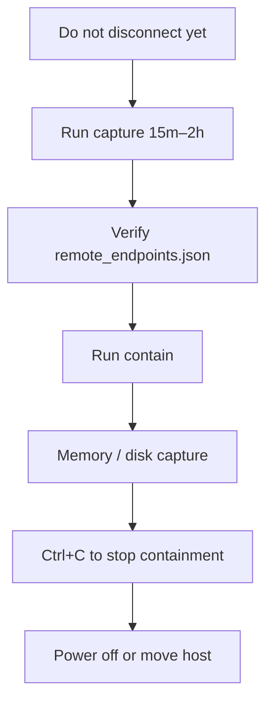
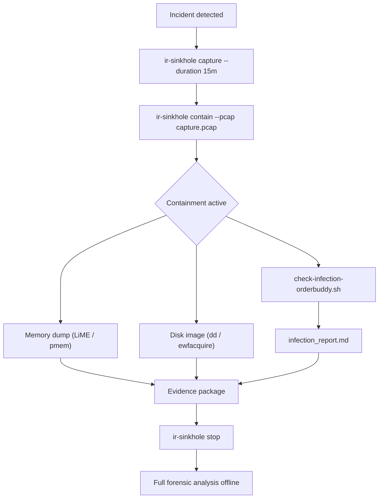

# How-to guides

Step-by-step workflows for IR Sinkhole: standard IR workflow, quick test, and troubleshooting.

---

## 1. Standard incident response workflow

Use this on a **compromised host** (or dedicated IR/test VM). Do **not** unplug the network before capture.



### Steps

1. **Capture (on the affected host, as root)**  
   ```bash
   sudo ir-sinkhole capture -d 15m -o /var/lib/ir-sinkhole
   ```  
   Adjust `-d` to `1h` or `2h` if you need a longer observation window. Keep tshark enabled (default) for replay.

2. **Verify output**  
   ```bash
   cat /var/lib/ir-sinkhole/remote_endpoints.json
   ```  
   You should see a list of `{"ip": "...", "port": "..."}` entries (C2 and other remote hosts the malware talked to).

3. **Start containment**  
   ```bash
   sudo ir-sinkhole contain -o /var/lib/ir-sinkhole
   ```  
   Leave this running in the foreground. Optionally open a second terminal for forensics.

4. **Run forensics**  
   - Memory dump (e.g. `dumpit`, `LiME`, or vendor tools)  
   - Disk image or critical file copy  
   - Process list, open files, network sockets  

5. **Stop containment**  
   Press **Ctrl+C** in the terminal where `contain` is running. This removes nftables rules and stops the sinkhole. Then power off or move the host as needed.

---

## 2. Quick test (no real malware)

Use a **test VM or lab host** with root. Goal: see Status → Capture → Contain → Stop without real C2.

### 2.1 Generate some outbound TCP traffic

In one terminal, create a short-lived connection so that `capture` sees at least one remote endpoint:

```bash
curl -s --connect-timeout 2 https://example.com >/dev/null || true
```

### 2.2 Capture (short)

```bash
sudo ir-sinkhole capture -d 60 -o /var/lib/ir-sinkhole
```

(60 seconds; use `--no-tshark` if tshark is not installed.)

### 2.3 Check endpoints

```bash
cat /var/lib/ir-sinkhole/remote_endpoints.json
```

You should see at least one entry (e.g. `example.com`’s IP and port 443).

### 2.4 Contain

```bash
sudo ir-sinkhole contain -o /var/lib/ir-sinkhole
```

In **another terminal**, run again:

```bash
curl -v https://example.com
```

The connection will be redirected to the sinkhole (you may get an HTTP 200 stub or replayed bytes). Traffic does not leave the host to the real example.com.

### 2.5 Stop

In the terminal where `contain` is running, press **Ctrl+C**. Optionally:

```bash
sudo ir-sinkhole stop
```

---

## 3. Using the ASCII menu (one-liner)

On a fresh host (or after removing `/opt/ir-sinkhole`):

```bash
curl -sSL https://raw.githubusercontent.com/Leviticus-Triage/ir-sinkhole/main/scripts/run.sh | bash
```

(Enter sudo password when prompted. The bootstrap downloads the menu and runs it with terminal stdin so the menu is interactive.)

- The script installs dependencies (apt), clones the repo to `/opt/ir-sinkhole`, sets up the venv, then shows the menu.
- Choose **[1] Status**, **[2] Capture**, **[3] Contain**, or **[4] Stop** and follow the prompts (duration, output dir, interface, etc.).

---

## 4. Troubleshooting

| Issue | What to do |
|-------|------------|
| `remote_endpoints.json` empty | Ensure there are active TCP connections during capture (run a browser or `curl` to a few sites before/during capture). |
| `nftables not available` | Install nftables (`apt install nftables`) and ensure kernel supports it. |
| `Permission denied` / not root | Use `sudo` for `capture` and `contain`. |
| Containment process died; firewall still active | Run `sudo ir-sinkhole stop` to remove the `ir_sinkhole` nftables table and PID file. |
| Replay not working (only stub) | Install scapy and ensure `capture.pcap` exists and contains traffic to the endpoint; replay DB is built from PCAP in `contain`. |

---

## 5. OrderBuddy-style C2 (example)

For malware that uses HTTP C2 on a custom port (e.g. OrderBuddy on port 1244):

1. Capture while the malware is active (so connections to C2_IP:1244 appear in `ss`/conntrack and in the PCAP).
2. `remote_endpoints.json` will list C2_IP and 1244 (and any other IP:port).
3. Contain redirects all new connections to C2_IP:1244 to the local sinkhole; replay or stub keeps the malware from seeing a disconnect.

No change to the workflow; only the endpoints and replay content are C2-specific.

---

## 6. Post-containment triage (companion script)

After containment is active, run the included triage script to check the host for infection indicators while the malware remains calm:

```bash
chmod +x scripts/examples/check-infection-orderbuddy.sh
sudo ./scripts/examples/check-infection-orderbuddy.sh 2>&1 | tee ~/infection_check.log
```

The script performs 17 read-only checks (malware artifacts, processes, C2 connections, DNS cache, persistence, browser history, SSH keys, etc.) and generates a Markdown report at `~/infection_report_<timestamp>.md`.

**Full workflow:**



**Adapt for your own campaigns:** Replace the IOCs (C2 IPs, domains, file paths) in the script with those from your specific incident. The 17-check structure is campaign-agnostic.
